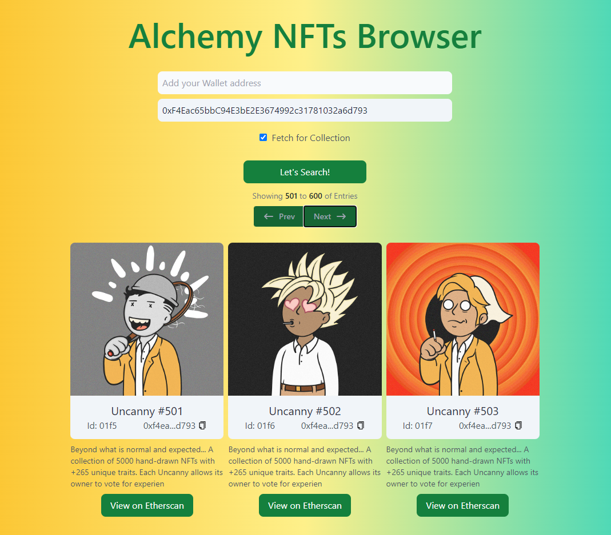

# RoadToWeb3 NFT Browser

## This project includes:

- How to fetch NFTs that belong to a wallet address
- How to fetch NFTs based on the collection it belongs to
- How to use RESTful API calls via Alchemy NFT API to fetch and display NFTs
- How to style your website with Next JS and Tailwind CSS

---

## Open issues & tweaks:

- // FIXME: Error on Search when Wallet and Collection address are filled but "Fetch for Collection" is unchecked
- // FIXME: Look for a valid condition to catch fetchNFTs first run (to use in fromNFT value for Pagination bar)
- ~~// TODO: Make process.env work !! Solved: use NEXT*PUBLIC*~~
- // TODO: Use "unknown" value for "Entries" on Collection pagination bar
- // TODO: Search per account "From" value is not not...
- // TODO: On Collection search: Check behavior when nextToken is not present -> then there are no more NFTs to fetch.
- ~~// TODO: Use a generic image when there's no media (nft.media[0].gateway)~~
- // TODO: Implenment Prev button for fetchNFTs search-> Keep previous startToken for pagination PREV (should be an array storing all previous nextToken)
- // TODO: Prev button: "Showing" & "To" increases instead of decreasing

---

